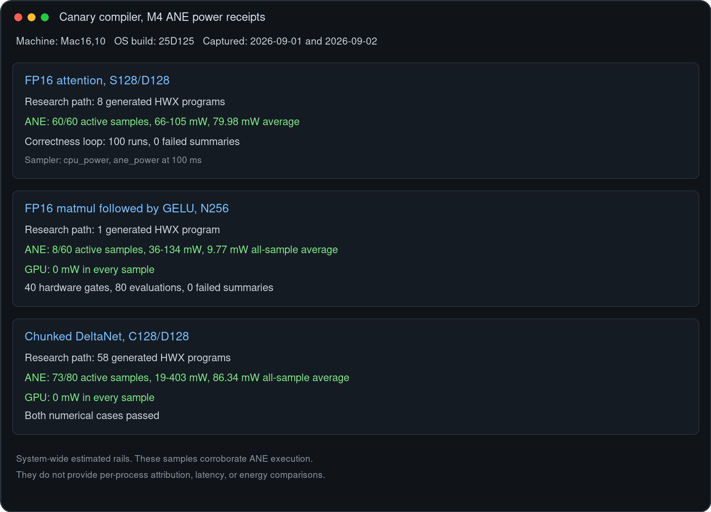

# MIL-to-HWX compiler

A research compiler that lowers textual MIL to new H16G HWX objects for the
Apple M4 Neural Engine, without calling Apple's compiler. It uses a typed graph,
ordinary compiler passes, target planning, packet encoders, a Mach-O writer,
and a provisioned userspace runtime. The pipeline it implements is the one
recovered in the article series *Inside the M4 Apple Neural Engine*, Part 4b.

## What this project is

- A canary. It shows that the compiler pipeline recovered by decompilation and
  live tracing is complete enough to emit programs the hardware accepts, on the
  primitive families listed below, on one machine and one OS build.
- A fixture set. Every supported family has a hardware test that compiles from
  MIL, runs the emitted object twice on an M4, and compares against independent
  CPU code. Rerunning those tests on other chips and OS builds is the most
  useful thing anyone can do with this repository.
- A reference for the HWX object format and the H16G descriptor fields, in the
  form of an encoder that writes them.

## What this project is not

- Not a replacement for Core ML, MLX, or Apple's ANE compiler. Apple's
  compiler has much broader operation, shape, and chip coverage; this one
  handles the rows in the table below.
- Not a maintained framework. Bug reports and fixture contributions from other
  hardware are welcome. Feature requests will mostly go unaddressed; fork it.
- Not usable in App Store software. The runtime loads Apple's private
  `AppleNeuralEngine.framework` and drives `_ANEClient` directly. These
  interfaces may change without notice.
- Not stable across OS releases. Every measured table and container layout is
  tied to macOS 26.3 (25D125), ANECompiler 9.202.0, and the H16G target.
- Not performance-competitive with Apple's compiler on the composed graphs
  measured below. Timings in `docs/VERIFICATION.md` remain correctness-gate
  samples; the dedicated A/B table below is the benchmark.

## Provenance

The HWX container format, the Task Descriptor
field layout, and the compiler pipeline were recovered by compiling MIL
programs written by the author with Apple's compiler, comparing the resulting
binaries byte by byte, running edited binaries on the hardware, and tracing
Apple's compiler under a debugger. No Apple source code was available or used.
No Apple binary code is reproduced in this repository.

The repository does not distribute Apple-compiled
HWX containers, extracted Task Descriptor rows, or Apple-compiled container
skeletons. Regression tests keep expected hashes and decoded field values.

`plugins/H16G/Encoding/*EncoderData.inc` contains Task
Descriptor words observed in Apple compiler output for specific operation and
geometry rows. They are measurements of a hardware interface, recorded and
indexed by the author, and are used where the descriptor grammar for that
family has not yet been decoded into per-field encoders.

See [DISCLAIMER.md](DISCLAIMER.md) for project scope, private-API risks, and
additional provenance notes.

## What the hardware tests do to your machine

Stock macOS will only load an HWX program that sits in the `aned` in-memory
cache for the calling executable. The hardware scripts therefore use `sudo`
to write the compiler's output under
`/Library/Caches/com.apple.aned/<build>/InMemoryModelCache/<executable>/`.
Nothing else on the system is modified. Read the scripts before running them.
The software test suite (`make test`) touches nothing outside `build/`.

## Pipeline

```text
MIL lexer and parser
  -> typed SSA graph
  -> normalize and decompose
  -> structural fusion
  -> H16G legality and numeric modes
  -> tiling, liveness, SRAM and DMA planning
  -> H16G task packets
  -> clean HWX object and binding manifest
```

The production route does not call `ANECCompile`, load an Apple-compiled HWX,
select a fixture name, or patch a binary container. `HWXObjectWriter` creates
the header, segments, sections, symbols, relocations, program metadata, tensor
metadata, and payloads from compiler data structures.

Support is bounded by decoded H16G families. Conv, matmul, ALU, and layout
families derive changing packet fields from shape, dtype, numeric mode, and
schedule state. Unary and reduction families currently use measured packet
tables indexed by semantic operation and geometry. Both forms emit into a new
object. Unknown operations, shapes, axes, dtypes, or transitions fail closed.

## Supported compiler surface

| Primitive | Current measured families |
|---|---|
| Conv1x1 | 16 fp16 channel/spatial geometries, optional ReLU |
| Regular Conv | C64/C128, S32/S64, K3/K5 |
| Depthwise Conv | C64/C128/C256/C512, S64, K3 |
| Matmul | square N128/N256/N512 and tiled multiples of 128 through N4096 |
| Binary ALU | add at N128..N2048; mul at N128/N512; max/min at N512 |
| Unary/LUT | ReLU, sigmoid, tanh, GELU, SiLU, exp, log, sqrt, rsqrt, reciprocal |
| Reduction | sum/mean/max over measured channel, height, and width axes |
| Layout | S2D and D2S B4/B8 families, including 64-byte physical row padding |
| Fused layout | S2D -> Conv1x1 -> D2S at natural C8/C16/C24/C32 |
| W8A8 | four-layer C64/S64 Conv1x1 chain with packed middle blocks |
| Mixed graph | H4/S64/D64 attention decomposition and fused task schedule |
| Composed regions | matmul -> reshape -> GELU at N128/N256; unmasked FP16 attention at S128/D128; N128 FP16 matrix-state affine scans |

The shape families are target facts, not workload recognizers. Adding coverage
means decoding another operation or geometry row and adding hardware tests.
The attention row is one 128x128 tile. The planner can describe larger tiled
forms, but the H16G assembler currently rejects them. Causal masking is not
implemented.

## Build and compile

Build the clean software suite on Apple silicon macOS:

```sh
make test
```

Compile a model:

```sh
./build/mil-hwxc \
  --mil tests/fixtures/conv_relu.mil \
  --model-root tests/models/conv_relu \
  --target H16G \
  --output build/conv-bundle
```

The output contains `program-0.hwx` and `manifest.json`.

## M4 hardware verification

Each script starts from MIL, emits a new object, provisions that exact object,
executes it twice, and compares outputs with independent CPU code.

```sh
bash tests/run_m4_hardware.sh
bash tests/run_depthwise_hardware.sh
bash tests/run_regular_conv_hardware.sh
bash tests/run_matmul_hardware.sh
bash tests/run_alu_hardware.sh
bash tests/run_unary_hardware.sh
bash tests/run_reduce_hardware.sh
bash tests/run_layout_hardware.sh
bash tests/run_online_reduction_hardware.sh
bash tests/run_affine_scan_hardware.sh
bash tests/run_matmul_gelu_hardware.sh
bash tests/run_compiler_ab_hardware.sh
```

### Composed M4 receipts

| Region | Geometry | Numerical gate | Dedicated ANE rail during capture |
|---|---|---|---|
| FP16 attention forward | S128/D128, unmasked | 2 standard runs; max error `9.92883e-06` | 60/60 active samples; 66-105 mW; 79.98 mW average |
| FP16 affine state scan | four N128 transitions | each stage within 1 FP16 ULP; final result within 3 ULP | 60/60 active samples; 37-152 mW; 60.20 mW average |
| Matmul -> reshape -> GELU | N128 and N256 | matmul exact; GELU max error `0.00610352` | N256: 41/60 active samples; 152 mW peak; 38.28 mW average |

For the power capture, each already-validated executable was repeated 100
times while `powermetrics` sampled `cpu_power,ane_power` every 100 ms. Every
repeat retained a passing numerical summary. An idle sample read `ANE Power:
0 mW`; the table records nonzero dedicated-rail samples observed during each
workload. Powermetrics values are estimates and are not benchmark results.
The ANE rail is system-wide. The capture launched no other ANE workload, and
the idle-to-active change is used as corroborating hardware evidence rather
than per-process attribution.



The timestamped text used for the screenshot is in
[`docs/evidence/composed-ane-powermetrics.txt`](docs/evidence/composed-ane-powermetrics.txt).

### ANECompiler latency comparison

This comparison runs the original MIL through Apple `ANECCompile` and the
research compiler, then evaluates both with the same IOSurfaces, inputs, QoS,
and synchronous completion boundary.

| FP16 graph | ANECompiler | Research compiler | Research relative to ANECompiler | Output comparison |
|---|---:|---:|---:|---|
| FA2 S128/D128 | 132.21 us | 1113.44 us | 8.42x slower | exact for 16,384 elements |
| Four-stage affine scan | unavailable | unavailable | unavailable | `ANECCompile` returned `InvalidMILProgram` for the nine-input graph |
| Matmul -> reshape -> GELU N256 | 105.64 us | 225.04 us | 2.13x slower | exact for 65,536 elements |

Each reported latency is the median of two independent run-level values. Each
run used 20 warmups and five alternating batches of 2,000 evaluations per
compiler. The run-level value is the median of the five batch medians. The FA2
run ranges were 131.54-132.88 us for ANECompiler and 1092.10-1134.77 us for the
research compiler. The matmul-GELU ranges were 105.21-106.06 us and
220.81-229.27 us.

The research FA2 bundle dispatches eight HWX artifacts for one graph
evaluation. The matmul-GELU bundle dispatches two. These results therefore
include the current runtime dispatch paths and measure usable whole-graph
latency. They do not isolate execution time inside one HWX program.

The two-run summary receipt is in
[`docs/evidence/compiler-ab-m4-2026-09-02.txt`](docs/evidence/compiler-ab-m4-2026-09-02.txt).

The reduction sweep covers 24 operation/geometry forms. The layout sweep covers
13 standalone S2D shapes, eight standalone D2S shapes, and four fused
S2D-Conv-D2S shapes. Every case executes twice.

## Runtime boundary

`ANEProvisionedRuntime` allocates IOSurfaces from the emitted binding manifest
and controls load, evaluate, and unload through `_ANEClient`. The manifest keeps
semantic tensor sizes separate from physical row, plane, batch, and allocation
sizes. This is required for narrow reduction and layout rows padded to 64 bytes.

Stock macOS still requires the HWX file in the `aned` in-memory cache namespace
for the calling executable. The compiler and runtime do not claim a daemon-free
kernel-driver path.

## License

Original project code and documentation are available under the
[MIT License](LICENSE). See [DISCLAIMER.md](DISCLAIMER.md) for project scope,
private-API risks, provenance, and legal context.
